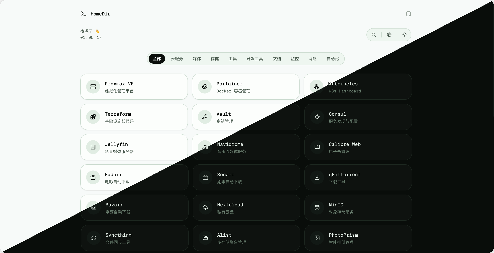

<div align="center">



# HomeDir

---

*轻量、快速的个人服务导航页，专为管理内外网服务地址而设计。*

</div>

## 特性

**导航管理**
- 站点分类管理
- 自动抓取网站 favicon
- 后台可视化管理站点、分类、配置

**效率操作**
- `⌘K` 全局搜索，按名称、描述、地址模糊匹配
- 键盘热键绑定，一键直达常用站点
- 自动探测网络环境，智能切换内网/外网地址

**体验细节**
- 深色 / 浅色主题，跟随系统自动切换
- 主题切换带 View Transition 过渡动画
- 实时时钟 + 时段问候语
- 分类标签栏带滑动指示器动效
- 长按 ⌘ 键浮层显示所有快捷键
- 全局等宽字体（Geist Mono）
- 数据存储 SQLite 单文件，备份迁移方便

## 技术栈

`Next.js 16` `Tailwind CSS v4` `shadcn/ui` `SQLite` `Lucide React`

## 目录结构

```
src/
├── app/              # 页面路由
│   ├── page.tsx      # 首页
│   ├── dash/         # 后台管理
│   └── api/          # API 路由
├── components/       # 组件
│   ├── admin/        # 后台管理组件
│   └── ui/           # shadcn/ui 基础组件
└── lib/              # 工具库
    ├── db.ts         # 数据库操作
    ├── auth.ts       # 认证逻辑
    └── icons.ts      # 图标处理
```

## 快速开始

### Docker 部署（推荐）

```yaml
# docker-compose.yml
services:
  homedir:
    image: 52lxcloud/homedir:latest
    container_name: homedir
    restart: unless-stopped
    ports:
      - "4027:4027"
    volumes:
      - ./data:/app/data
```

```bash
docker compose up -d
```

启动后访问 `http://localhost:4027/dash` 设置管理密码。

### 本地开发

```bash
pnpm install
pnpm dev
```

访问 `http://localhost:3000/dash` 进入后台。数据保存在 `data/` 目录。

---

如果觉得这个项目对你有帮助，欢迎点个 ⭐ 支持一下。
